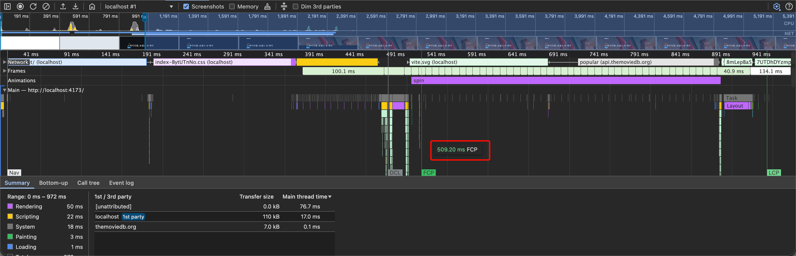
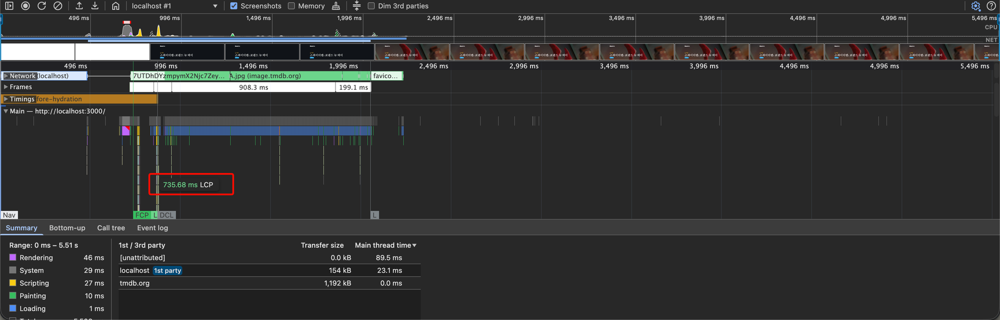
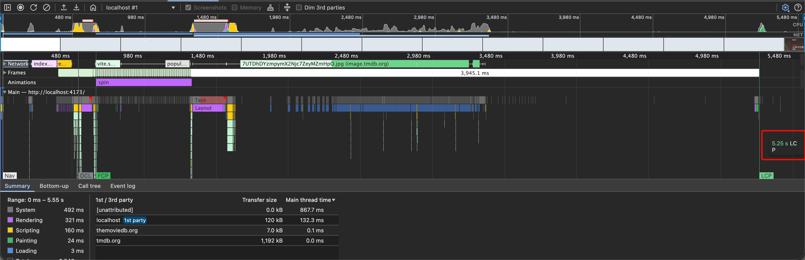
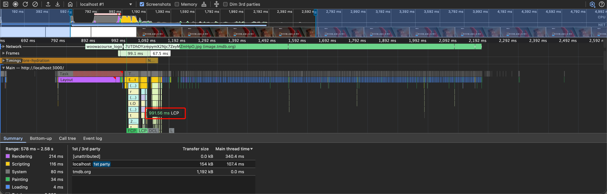
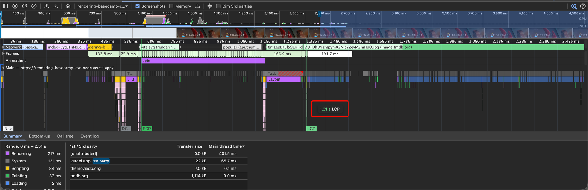
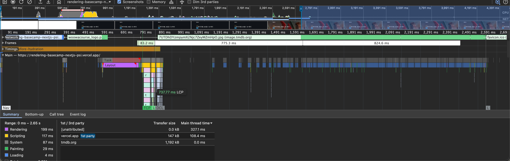

# 성능 시나리오

> `/` 홈 화면 Fast 4G 기준 LCP 가 4초이다. LCP 를 3초까지 개선하면, 이탈율이 10% 감소하여, 신규 유저 유입을 더 늘릴 수 있을 것이다.

## 0. 측정 케이스

| Case | 환경 | 네트워크 | CPU | 상태 |
| --- | --- | --- | --- | --- |
| [A](#case-a--로컬-production--fast-4g) | 로컬 production 빌드 | Fast 4G | 스로틀 없음 | ✅ 완료 |
| [B](#case-b--로컬-production--fast-4g--cpu-4x) | 로컬 production 빌드 | Fast 4G | 4x slowdown | ✅ 완료 |
| [C](#case-c--배포-환경--fast-4g--cpu-4x) | 배포 환경 (Vercel) | Fast 4G | 4x slowdown | ✅ 완료 |

### 공통 측정 방법

| 항목 | 값 |
| --- | --- |
| 페이지 | `/` (홈) |
| 도구 | Chrome DevTools > Performance 패널 (Screenshots 활성화) |
| 조건 | 시크릿 창, Network > Disable cache 활성화 |
| CSR 실행 (로컬) | `../react-csr` 에서 `npm run build && npm run preview` → `http://localhost:4173/` |
| SSR 실행 (로컬) | `nextjs` 에서 `npm run build && npm run start` → `http://localhost:3000/` |
| CSR 배포 URL | https://rendering-basecamp-csr-neon.vercel.app/ |
| SSR 배포 URL | https://rendering-basecamp-nextjs-psi.vercel.app/ |

### 개선 내용 (Next.js SSR)

`src/pages/index.tsx` 에서 `getServerSideProps` 로 `popular` 영화 목록을 서버에서 미리 가져와 props 로 내려준다.
그 결과 서버 응답 HTML 에 히어로 `h1`(영화 제목)과 영화 목록이 이미 포함되어 LCP 까지의 경로에서 클라이언트 JS 다운로드와 실행, API 요청 단계가 빠진다.

---

## Case A — 로컬 production / Fast 4G

### A-1. 기준치 (Baseline) — `react-csr`



| 지표 | 값 |
| --- | --- |
| **LCP** | **약 0.96 s** (타임라인 기준) |
| FCP | 509.20 ms |
| LCP 요소 | `h1.text-3xl.font-semibold` (상단 히어로 영화 제목) |
| DCL | 약 0.49 s |

#### 타임라인 분석

```
0 ms ──────── ~0.19 s ──────── ~0.44 s ─────── ~0.49 s ──── 0.51 s ─────── ~0.63 s ─────── ~0.88 s ──── ~0.96 s
│ HTML(빈 #root) │ index.css 다운로드 │ JS 번들 다운로드 │ DCL        │ FCP(스피너)  │ popular API 요청 │ 응답 후 렌더  │ LCP(h1)
```

1. **HTML 수신 → 빈 화면**: 서버가 내려주는 HTML 에는 `<div id="root">` 만 있어 약 0.19 s 동안 받는 문서에 콘텐츠가 없다.
2. **CSS / JS 번들 다운로드**: `index-*.css` (~0.19 s → 0.44 s) 와 JS 번들(~0.44 s → 0.49 s)을 받아온다.
3. **JS 실행 후 로딩 스피너 (FCP)**: DCL(~0.49 s) 이후 React 가 마운트되며 `spin` 애니메이션이 그려진다. 이때 **FCP 509.20 ms** 가 찍히지만, 사용자에게 보이는 건 스피너뿐이다.
4. **API 요청 → 렌더**: 마운트 이후에야 `popular` 영화 API(`api.themoviedb.org`)를 요청하고(~0.63 s → 0.88 s), 응답이 오면 히어로 영역의 `h1` 이 그려지며 **LCP 약 0.96 s** 가 찍힌다.
5. **이미지는 그 이후**: 영화 포스터/히어로 이미지(`8mLepBa5…`, `7UTDhDY…`)는 LCP 직전과 직후부터 다운로드된다.

#### 병목 요약

LCP 까지의 경로가 HTML → CSS/JS 다운로드 → JS 실행 → API 요청 → 렌더로 직렬화된 CSR 워터폴이 주된 원인이다.
FCP(스피너)와 LCP(h1) 사이 약 0.45 s 는 대부분 마운트 후 시작되는 API 왕복 시간이다.

> ⚠️ 시나리오 문구는 "LCP 4초" 이지만, 이 케이스의 측정값은 **약 0.96 s** 로 이미 목표(3 s)보다 낮다. 로컬 환경에 고성능 CPU 라서 TTFB 와 JS 실행 비용이 거의 드러나지 않기 때문으로 보인다. 그래서 [Case B](#case-b--로컬-production--fast-4g--cpu-4x) 에서 CPU 스로틀을 걸어 재측정했다.

### A-2. 개선 — `nextjs` (SSR)



| 지표 | 값 |
| --- | --- |
| **LCP** | **735.68 ms** |
| FCP | 약 0.74 s (LCP 와 거의 동일 시점) |
| LCP 요소 | `h1.text-3xl.font-semibold` (CSR 과 동일 요소) |
| DCL | 약 0.86 s (FCP/LCP 이후) |

#### 타임라인 분석

1. **HTML 수신**: `/` 문서 응답에 이미 렌더링된 마크업(히어로 제목, 영화 목록)이 담겨 온다. 서버가 응답 전에 TMDB API 를 호출하므로 문서 응답(TTFB)은 CSR 보다 길어지지만, 클라이언트에서 API 응답을 기다릴 필요는 없다.
2. **FCP ≈ LCP (735.68 ms)**: HTML 이 파싱되자마자 h1 이 포함된 첫 화면이 그려진다. 하이드레이션(`before-hydration` 구간)이나 DCL 보다도 먼저 페인트가 일어난다.
3. **JS 로드 & 하이드레이션**: 페인트 이후 `before-hydration` 구간 동안 Next.js 런타임/페이지 번들을 받아 실행하고 인터랙션을 붙인다.
4. **이미지는 그 이후**: 히어로 배경 이미지(`7UTDhDY…jpg`)는 약 0.74 s → 2.0 s 동안 다운로드되지만, LCP 후보로 갱신되지 않아 LCP 는 텍스트로 유지된다.

#### 왜 FCP 와 LCP 가 붙어 있을까?

- **SSR 이라서**: 서버가 데이터를 채운 완성된 HTML 을 내려주므로, 처음 화면이 그려질 때 가장 큰 텍스트 요소(h1)도 함께 그려진다. 첫 페인트가 곧 가장 큰 콘텐츠의 페인트가 된다.
  CSR 에서는 첫 페인트가 로딩 스피너(509 ms)이고, h1 은 API 응답 이후(약 0.96 s)에 그려지므로 둘 사이에 간격이 생긴다.
- **참고 — dev 모드에서는 둘 다 1.79 s 였다**: Pages Router 의 `next dev` 는 스타일이 적용되기 전 화면 깜빡임(FOUC)을 막기 위해 `body { display: none }` 스타일(`data-next-hide-fouc`)을 넣어두고, 클라이언트에서 CSS 가 준비되는 시점에 제거한다.
  그래서 dev 에서는 하이드레이션 직전까지 아무것도 그려지지 않았지만, production 에서는 이 처리가 없어 HTML 수신 직후(하이드레이션 전)에 바로 페인트된다.

### A-3. 결과 비교

| 지표 | CSR (`react-csr`) | SSR (`nextjs`) | 변화 |
| --- | --- | --- | --- |
| **LCP** | 약 0.96 s | **735.68 ms** | **약 −0.22 s (약 23% 개선)** |
| FCP | 509.20 ms (스피너) | 약 0.74 s (LCP 와 동일) | 약 +0.23 s |
| LCP 요소 | `h1.text-3xl.font-semibold` | `h1.text-3xl.font-semibold` | 동일 |
| LCP 경로 | HTML → JS → 실행 → API → 렌더 | HTML(데이터 포함) → 페인트 | 클라이언트 API 왕복 제거 |

#### 결론

- 시나리오 목표인 LCP 3 s 이하는 두 방식 모두 만족하며 SSR 로 LCP 를 약 0.96 s 에서 735.68 ms 로 추가 단축했다.
- 대신 서버가 응답 전에 API 를 기다리므로 TTFB 와 FCP 는 오히려 늘어났다 (509 ms → 약 0.74 s). CSR 은 스피너를 빨리 보여주고 콘텐츠를 나중에 보여주는 반면, SSR 은 조금 늦게 시작하지만 처음부터 콘텐츠를 보여준다는 트레이드오프가 있다.

---

## Case B — 로컬 production / Fast 4G + CPU 4x

> 실제 사용자(중저사양 모바일)의 JS 실행과 레이아웃 비용을 재현하기 위해 DevTools Performance 패널에서 **CPU: 4x slowdown** 을 추가로 적용했다.

### B-1. 기준치 (Baseline) — `react-csr`



| 지표 | 값 |
| --- | --- |
| **LCP** | **5.25 s** |
| FCP | 약 0.6 s (스피너) |
| LCP 요소 | 확인 필요 (Summary 미캡처) |
| DCL | 약 0.5 s |

#### 타임라인 분석

```
0 ms ─────── ~0.5 s ──── ~0.6 s ─────────── ~1.1 s ─────── ~1.25 s ─────── ~1.5 s ─────────────── ~3.3 s ─────────── 5.25 s
│ HTML/CSS/JS │ DCL     │ FCP(스피너)       │ popular API   │ 응답 후 렌더   │ 히어로 이미지 다운로드 │ 화면 갱신 없음      │ LCP
│ 다운로드     │         │ API 요청 대기      │ 응답          │ (Long Task)   │ + 메인 스레드 작업     │ (3,945 ms 프레임)  │
```

1. **HTML → CSS/JS 다운로드 → DCL(~0.5 s)**: Case A 와 같은 흐름이지만, JS 파싱과 실행이 4배 느려진다.
2. **FCP(~0.6 s) = 스피너**: React 마운트 후 `spin` 애니메이션이 약 0.65 s 동안 노출된다.
3. **API 응답 → 렌더 (Long Task)**: `popular` API 응답(~1.25 s) 후 영화 목록을 렌더링하는 `Task`/`Layout` 이 **Long Task(빨간 빗금)** 로 찍힌다.
4. **긴 공백**: 이후 히어로 이미지(`7UTDhDY…jpg`, ~1.6 s → 3.3 s) 다운로드와 메인 스레드 작업이 이어지는 동안 **3,945.1 ms 짜리 프레임** 이 하나 찍혀 있다. 스크린샷 상으로도 이 구간 동안 콘텐츠가 보이지 않는다.
5. **LCP 5.25 s**: 공백 프레임이 끝나는 시점에 LCP 가 찍힌다.

#### 병목 요약

- CPU 가 느려지자 JS 실행 → API 요청 → 렌더 → 레이아웃의 직렬 경로 각 단계가 모두 길어졌고 특히 API 응답 후 렌더와 레이아웃 이후 화면이 실제로 갱신되기까지 약 3.9 s 가 걸렸다.
- 측정값 5.25 s 는 시나리오의 "LCP 4초" 보다도 나쁜 수치로, 실사용 환경에서 시나리오 문제가 실제로 재현된 결과다.

> ⚠️ 3,945 ms 공백 프레임의 정확한 원인(LCP 요소가 h1 → 히어로 이미지로 바뀌었는지, 렌더링 지연인지)은 아직 확인하지 못했다. LCP 마커의 Summary(요소/타입)를 확인하고 여러 번 측정해 재현되는지 검증이 필요하다.
> 같은 조건(Fast 4G + CPU 4x)의 배포 환경 측정([Case C](#case-c--배포-환경--fast-4g--cpu-4x))에서는 이 공백이 나타나지 않고 CSR LCP 가 1.31 s 였다. 따라서 Case B 의 5.25 s 는 로컬 측정 시의 이상치일 가능성이 있다.

### B-2. 개선 — `nextjs` (SSR)



| 지표 | 값 |
| --- | --- |
| **LCP** | **991.56 ms** |
| FCP | 약 0.95 s (LCP 와 거의 동일 시점) |
| LCP 요소 | 확인 필요 (Summary 미캡처, Case A 기준 `h1.text-3xl.font-semibold` 추정) |
| DCL | 약 1.0 s (FCP/LCP 직후) |

#### 타임라인 분석

1. **HTML 수신 → Layout (Long Task)**: 데이터가 채워진 HTML 을 받은 뒤, 영화 목록 전체에 대한 `Layout` 이 약 0.2 s 짜리 **Long Task** 로 찍힌다. CPU 가 4배 느려지면서 큰 DOM 의 레이아웃 비용이 드러났다.
2. **FCP ≈ LCP (991.56 ms)**: 레이아웃 직후 h1 이 포함된 첫 화면이 그려진다. Case A 와 마찬가지로 하이드레이션(`before-hydration`) 완료 전에 페인트가 일어난다.
3. **JS 실행 & 하이드레이션**: 페인트 이후 번들을 실행하며 하이드레이션한다. CPU 스로틀로 스크립트 실행 구간이 길어졌지만, 이미 화면이 그려진 이후라 LCP 에는 영향을 주지 않는다.
4. **이미지는 그 이후**: 히어로 배경 이미지(`7UTDhDY…jpg`)는 약 1.0 s → 2.15 s 동안 다운로드된다.

#### 왜 SSR 은 CPU 스로틀의 영향을 덜 받을까?

- CSR 은 JS 실행이 끝나야 API 요청이 시작되고 응답 후 다시 JS 로 렌더해야 LCP 가 찍힌다. CPU 비용이 LCP 경로 위에 여러 번 올라가 있다.
- SSR 은 LCP 경로가 HTML 파싱 → 레이아웃 → 페인트뿐이고 JS 실행(하이드레이션)은 페인트 이후로 밀려 있다. 그래서 CPU 가 느려져도 LCP 에 더해지는 비용은 레이아웃 정도에 그친다.

### B-3. 결과 비교

| 지표 | CSR (`react-csr`) | SSR (`nextjs`) | 변화 |
| --- | --- | --- | --- |
| **LCP** | 5.25 s | **991.56 ms** | **약 −4.26 s (약 81% 개선)** |
| FCP | 약 0.6 s (스피너) | 약 0.95 s (LCP 와 동일) | 약 +0.35 s |
| Long Task | API 응답 후 렌더/Layout | 첫 페인트 전 Layout (~0.2 s) | — |
| LCP 경로 | HTML → JS → 실행 → API → 렌더 → 레이아웃 | HTML(데이터 포함) → 레이아웃 → 페인트 | JS 실행과 API 왕복 제거 |

#### 결론

- CSR 기준치 5.25 s 는 시나리오 목표(3 s)를 크게 넘지만, SSR 적용 후 **991.56 ms** 로 목표를 달성했다.
- Case A(−0.22 s) 보다 개선 폭이 훨씬 크다. CPU 성능이 낮을수록 CSR 의 직렬 워터폴 비용이 커지고 SSR 의 이점도 커진다.
- FCP 는 여전히 SSR 이 늦지만(서버 API 대기), 첫 페인트부터 실제 콘텐츠가 보인다.
- 남은 개선 여지: 첫 페인트 전 `Layout` Long Task(~0.2 s) — 초기 렌더링하는 영화 목록 DOM 크기를 줄이거나, 이미지 크기 속성 지정 등으로 레이아웃 비용을 낮출 수 있다.

---

## Case C — 배포 환경 / Fast 4G + CPU 4x

> Vercel 에 배포한 CSR/SSR 앱을 Case B 와 같은 조건(Fast 4G + CPU 4x slowdown)으로 측정했다.

### C-1. 기준치 (Baseline) — `react-csr`



| 지표 | 값 |
| --- | --- |
| **LCP** | **1.31 s** |
| FCP | 약 0.6 s (스피너) |
| LCP 요소 | 확인 필요 (Summary 미캡처) |
| DCL | 약 0.51 s |

#### 타임라인 분석

```
0 ms ─────── ~0.16 s ─────── ~0.47 s ──── ~0.51 s ──── ~0.6 s ─────────── ~0.95 s ──────── ~1.12 s ─────── ~1.14 s ──────── 1.31 s
│ HTML(빈 #root) │ CSS/JS 다운로드 │ DCL        │ FCP(스피너) │ API 요청 대기    │ popular API     │ 렌더/Layout    │ LCP
│               │               │            │            │                 │ 응답            │ (Long Task)   │
```

1. **HTML → CSS/JS 다운로드 → DCL(~0.51 s)**: 빈 HTML(~0.16 s) 이후 `index-*.css`, JS 번들을 순서대로 받아온다.
2. **FCP(~0.6 s) = 스피너**: React 마운트 후 `spin` 애니메이션이 약 0.5 s 동안 노출된다.
3. **API 요청 → 응답**: `popular` 영화 API 요청이 약 0.95 s → 1.12 s 에 걸쳐 진행된다.
4. **렌더 + Layout (Long Task)**: 응답 후 영화 목록 렌더링과 `Layout` 이 약 0.17 s 짜리 **Long Task** 로 찍히고, 끝나자마자 **LCP 1.31 s** 가 찍힌다.
5. **이미지는 그 이후**: 히어로 이미지(`7UTDhDY…jpg`)는 LCP 시점부터 약 2.5 s 이후까지 다운로드된다.

#### 병목 요약

- Case B 와 같은 직렬 워터폴(JS 실행 → API 요청 → 렌더 → 레이아웃)이지만 Case B 의 3.9 s 공백 프레임은 나타나지 않았다.
- FCP(스피너)와 LCP 사이 약 0.7 s 는 API 대기와 렌더/레이아웃 Long Task 다.

### C-2. 개선 — `nextjs` (SSR)



| 지표 | 값 |
| --- | --- |
| **LCP** | **737.77 ms** |
| FCP | 약 0.68 s (LCP 직전) |
| LCP 요소 | 확인 필요 (Summary 미캡처, Case A 기준 `h1.text-3xl.font-semibold` 추정) |
| DCL | 약 0.75 s (FCP/LCP 직후) |

#### 타임라인 분석

1. **HTML 수신 (~0.25 s)**: Vercel 서버에서 TMDB API 를 호출해 데이터를 채운 HTML 을 내려준다. 문서 수신이 CSR(~0.16 s) 보다 늦게 끝난다.
2. **Layout (Long Task)**: 약 0.28 s → 0.46 s 동안 영화 목록 전체에 대한 `Layout` 이 **Long Task** 로 찍힌다 (Case B 와 동일한 패턴).
3. **FCP(~0.68 s) → LCP(737.77 ms)**: 하이드레이션(`before-hydration`) 완료 전에 h1 이 포함된 첫 화면이 그려진다.
4. **JS 실행 & 하이드레이션**: 페인트 직후 스크립트 실행(노란 구간)과 하이드레이션이 이어진다.
5. **이미지는 그 이후**: 히어로 배경 이미지(`7UTDhDY…jpg`)는 약 0.78 s → 2.45 s 동안 다운로드된다.

### C-3. 결과 비교

| 지표 | CSR (`react-csr`) | SSR (`nextjs`) | 변화 |
| --- | --- | --- | --- |
| **LCP** | 1.31 s | **737.77 ms** | **약 −0.57 s (약 44% 개선)** |
| FCP | 약 0.6 s (스피너) | 약 0.68 s | 약 +0.08 s |
| HTML 문서 수신 완료 | 약 0.16 s | 약 0.25 s | 약 +0.09 s (서버 API 대기) |
| Long Task | API 응답 후 렌더/Layout | 첫 페인트 전 Layout | — |
| LCP 경로 | HTML → JS → 실행 → API → 렌더 → 레이아웃 | HTML(데이터 포함) → 레이아웃 → 페인트 | JS 실행과 API 왕복 제거 |

#### 결론

- 배포 환경에서도 SSR 로 LCP 를 1.31 s 에서 737.77 ms 로 약 44% 단축했다.
- CSR 기준치(1.31 s)도 시나리오 목표(3 s)보다는 낮다. 다만 SSR 은 스피너 없이 첫 페인트부터 실제 콘텐츠를 보여주고 LCP 경로에서 API 왕복이 빠져 네트워크와 기기 성능이 나빠질수록 차이가 벌어지는 구조다.
- 서버 API 대기로 HTML 수신과 FCP 가 소폭 늦어지는 트레이드오프는 배포 환경에서도 동일하게 나타났다 (각 약 +0.09 s, +0.08 s).

---

## 종합

| Case | 환경 | CSR LCP | SSR LCP | 변화 | 목표(3 s) 달성 |
| --- | --- | --- | --- | --- | --- |
| A | 로컬 / Fast 4G | 약 0.96 s | 735.68 ms | 약 −23% | CSR ✅ / SSR ✅ |
| B | 로컬 / Fast 4G + CPU 4x | 5.25 s ⚠️ | 991.56 ms | 약 −81% | CSR ❌ / SSR ✅ |
| C | 배포 / Fast 4G + CPU 4x | 1.31 s | 737.77 ms | 약 −44% | CSR ✅ / SSR ✅ |

> ⚠️ Case B 의 CSR 5.25 s 는 3.9 s 공백 프레임이 포함된 값으로, 같은 조건의 배포 측정(Case C)에서는 재현되지 않았다. 재측정이 필요하다.

- 모든 케이스에서 SSR 적용 후 LCP 가 단축되었고, SSR LCP 는 모두 시나리오 목표인 3 s 이하이다.
- SSR 은 LCP 경로에서 클라이언트 JS 실행과 API 왕복을 제거하므로, CPU 스로틀을 건 케이스(B, C)에서 개선 폭이 더 컸다 (A −23% → C −44%).
- 트레이드오프로 서버가 API 응답을 기다리는 만큼 HTML 수신과 FCP 는 소폭 늘어난다.
- SSR 에서 남은 병목은 첫 페인트 전 `Layout` Long Task(약 0.2 s)로, 초기 렌더링하는 영화 목록 DOM 크기를 줄이면 추가 개선 여지가 있다.
