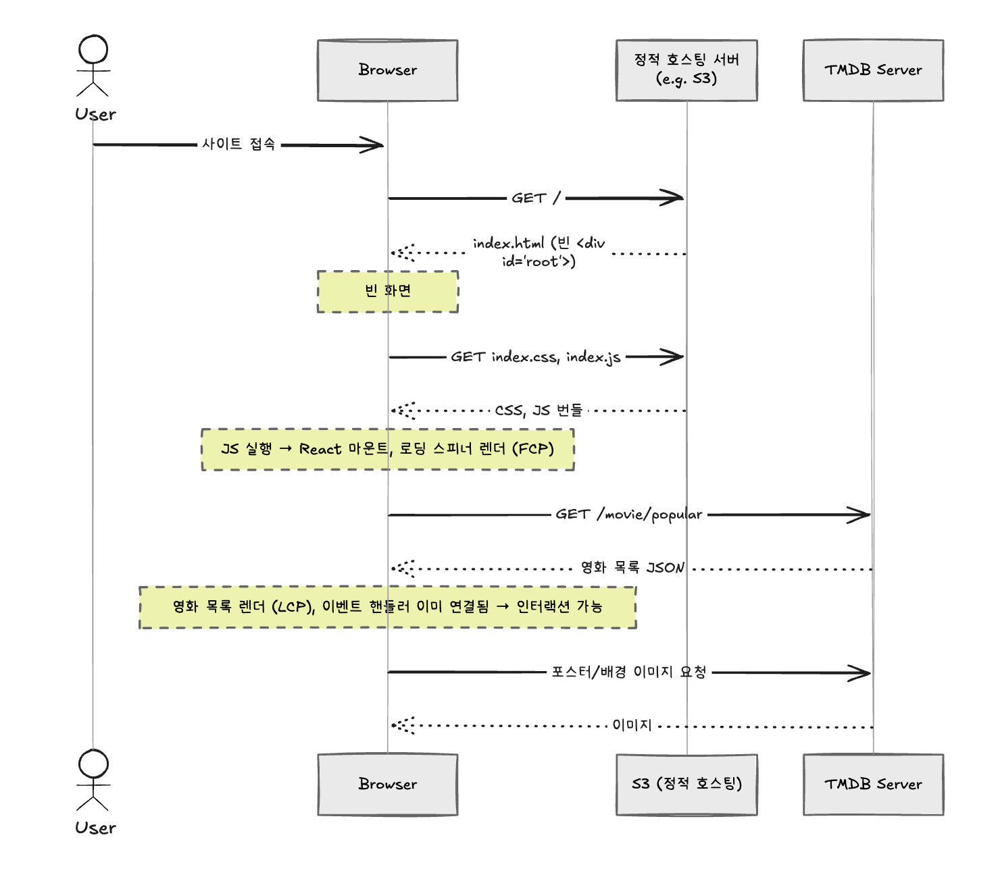
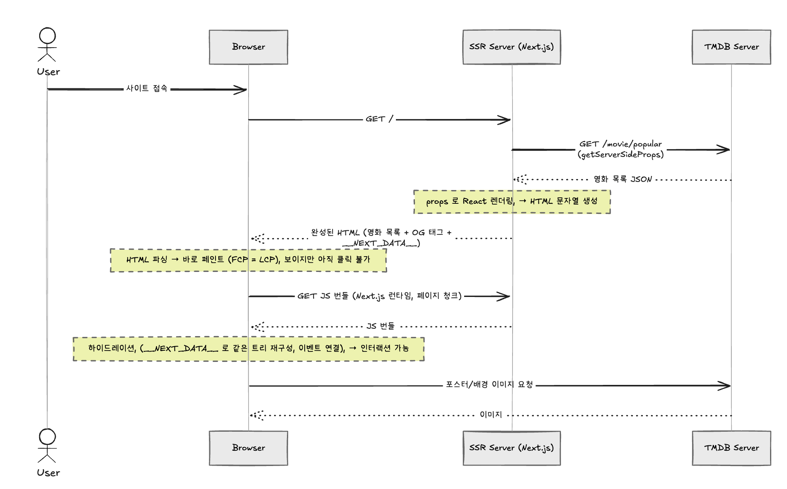

## 🕵️ 셀프 리뷰

### 제출 전 체크 리스트

- [x] 기능 요구 사항을 모두 구현했고, 정상적으로 동작하는지 확인했나요?
- [x] 배포한 데모 페이지에 정상적으로 접근할 수 있나요?
  - 배포 링크 기입:
    - csr : https://rendering-basecamp-csr-neon.vercel.app/
    - ssr : https://rendering-basecamp-nextjs-psi.vercel.app/

## 🧠 리뷰를 통한 생각 나눔

### 1. 성능 개선 - Chrome performance 에서 Fast 4G 기준 LCP 를 측정하고, 전후 결과를 비교한다.

[여기](./performance-scenario.md) 에 자세히 작성해뒀지만, CSR 기반 앱을 SSR 기반으로 바꾸니 LCP 가 크게 개선된 것을 확인할 수 있었어요!

| Case | 환경                               | CSR LCP   | SSR LCP   | 변화    |
| ---- | ---------------------------------- | --------- | --------- | ------- |
| A    | 로컬 production / Fast 4G          | 약 0.96 s | 735.68 ms | 약 −23% |
| B    | 로컬 production / Fast 4G + CPU 4x | 5.25 s    | 991.56 ms | 약 −81% |

처음에 Fast 4G 만 걸고 측정했을 때는 CSR 도 LCP 가 1초 이하로 나와서 시나리오(LCP 4초)가 재현되지 않았었습니다..!
로컬 서버 + 고성능 CPU 라 JS 실행 비용이 거의 없기 때문이라고 판단했고 실제 저사양 모바일 환경을 흉내 내려고 CPU 4x slowdown 을 추가로 걸어보니 CSR 의 LCP 가 5.25 s 까지 늘어났어요!

두 렌더링 방식의 차이점은 아래와 같아요.

**[CSR]**

```
HTML(빈 #root) → CSS/JS 다운로드 → JS 실행(React 마운트, 스피너 = FCP) → popular API 요청 → 응답 후 렌더 → LCP(h1)
```

LCP 까지 가는 경로가 꽤나 깁니다. JS 가 실행돼야 API 요청이 시작되고 응답이 와야 다시 JS 로 렌더링하기 때문에, LCP 까지 가는 동안 CPU가 자주 참여하게 돼요.
그러다 보니 CPU 가 느려질수록 LCP 가 급격히 나빠질 수 있는 구조에요.

**[SSR]**

```
서버에서 TMDB API 호출 → 데이터가 채워진 HTML 응답 → 파싱/레이아웃 → 페인트(FCP = LCP) → JS 로드 & 하이드레이션
```

LCP 까지 클라이언트 JS 실행과 API 요청이 빠졌고, 하이드레이션(간단히 설명하면 동작을 할 수 있는 시점\_HTML에 js를 연결하는 시점)이 페인트 이후에 발생해요.
CPU의 개입(여기서는 JS실행/하이드레이션 시점이라고 봐도 됨)이 확실히 줄어든 덕분에 개선 폭이 훨씬 컸어요.

다만 트레이드오프도 있는데요..! 서버가 API 응답을 기다린 뒤에 HTML 을 내려주기 때문에 TTFB 와 FCP 는 오히려 늘어났어요(509 ms → 약 0.74 s).
CSR 은 "빨리 스피너를 보여주고 나중에 콘텐츠", SSR 은 "조금 늦게 시작하지만 처음부터 콘텐츠" 를 보여주는 특징(?)이 있구나 싶었어요!

개인적으로 신기했던 건 퍼포먼스 탭에서 SSR 기반의 웹은 FCP 와 LCP 가 붙어있다는 점이었어요!
서버에서 데이터까지 채워진 완성된 HTML 을 그대로 받다 보니, 처음 화면이 그려지는 순간 가장 큰 텍스트 요소(h1)도 함께 그려져서 "첫 페인트 = 가장 큰 콘텐츠의 페인트" 가 되기 때문이라고 생각해요.
반면 CSR 은 첫 페인트가 로딩 스피너이고, h1 은 API 응답 이후에 그려지기 때문에 둘이 붙어있지 않아요!
지난 미션 때는 매번 떨어져 있어서 당연한 줄 알았는데 그렇지 않다는 게 개인적으로는 신기하고 충격적이었어요..!

### 2. Open Graph Tag 개선 - `/detail/:id` 를 공유했을 때, 영화 상세 정보가 보이는지 확인한다.

자세한 내용은 [여기](./open-graph.md) 에 정리해뒀어요!

미리보기 카드를 만드는 크롤러(카카오톡, 슬랙 등)는 대부분 JS 를 실행하지 않고 처음 받은 HTML 만 읽어요.
그러다 보니 CSR 은 서버 HTML 에 빈 `<div id="root">` 만 있어서 JS 로 태그를 넣어도 크롤러가 보지 못해 OG에서 매우 불리해요.
(동일한 원리로 CDN 캐싱, SEO에도 불리하죠!)
SSR 은 서버에서 태그를 채운 HTML 을 내려주기 때문에 크롤러가 바로 읽을 수 있다는 장점이 있어요.

여기서는 `<Head>` 로 OG 태그를 넣었어요.

| 페이지                   | OG 내용                                                                                           |
| ------------------------ | ------------------------------------------------------------------------------------------------- |
| 홈 `/`                   | 사이트 공통 정보 (`og:type=website`, 첫 번째 인기 영화 배경 이미지)                               |
| 상세 `/detail/[movieId]` | `getServerSideProps` 로 받은 `movieDetail` 기반 영화별 제목·줄거리·이미지 (`og:type=video.movie`) |

구현하면서 신경 쓴 부분은 아래와 같아요.

- 중복 태그 처리: 상세 페이지는 내부에서 `<Home />` 을 함께 렌더링해서 홈/상세의 OG 태그가 둘 다 렌더링돼요. `next/head` 는 같은 `key` 를 가진 태그가 있으면 나중에 렌더링된 것만 처리하므로, 상세 페이지의 `<Head>` 를 `<Home />` 보다 뒤에 두어 상세 태그가 덮어쓰도록 했어요.
- 이미지: OG 이미지는 가로형이 권장돼서 `backdrop_path` 를 우선 쓰고, 없으면 `poster_path` 를 써요. 둘 다 없으면 크롤러가 상대 경로를 읽지 못하므로 `og:image` 를 아예 넣지 않도록 했어요!

<!-- TODO: 공유 미리보기 스크린샷 (카카오톡 / opengraph.xyz) -->

### 3. [선택] SEO 개선 - 사이트 페이지 하나하나가 검색 결과로 나오는지 확인한다.

<!-- TODO: 진행 여부에 따라 작성 (sitemap.xml, robots.txt, canonical, description 등) -->

### 4. 유저가 사이트에 접속했을 때, 브라우저가 HTML 을 요청하는 것부터 시작하여, 유저가 정상적으로 인터랙션을 하기까지의 과정을 시퀀스 다이어그램으로 표현하고 설명해보아요. SSR 와 CSR 모두 그림과 설명이 필요합니다. (Browser, S3, SSR Server, TMDB Server 등의 요소를 활용하여 표현합니다.)

#### CSR



1. 브라우저가 정적인 리소스를 내려주는 서버에 HTML 을 요청하면, 내용이 비어 있는 `index.html` 을 받아요.
2. 브라우저는 HTML을 위에서부터 읽어 내려가면서 src가 붙어있는 주소로 CSS/JS 번들을 다운로드해요. (정적 리소스를 내려주는 서버와 동일한 주소일 거예요)
3. JS 가 실행되면서 React 가 실행되고 데이터가 없으니 로딩 스피너를 그려요. (FCP)
4. 마운트 이후에야 브라우저가 직접 TMDB 에 영화 목록을 요청해요.
5. 응답이 오면 영화 목록을 렌더링해요. (LCP) React 가 처음부터 DOM 을 만들었으므로 이벤트 핸들러도 이미 붙어 있어 바로 인터랙션할 수 있어요.

#### SSR



1. 브라우저가 SSR 서버에 HTML 을 요청해요.
2. 서버는 `getServerSideProps` 에서 TMDB 에 영화 목록을 요청하고 받은 데이터로 React 컴포넌트를 렌더링해 HTML 을 만들어요.
3. 데이터와 OG 태그가 모두 채워진 HTML 을 응답해요. 브라우저는 파싱하자마자 콘텐츠를 그려요. (FCP = LCP)
4. 이 시점에는 화면은 보이지만 이벤트 핸들러가 없어서 클릭해도 반응하지 않아요.
5. JS 번들을 받아 실행하면서 하이드레이션을 해요. HTML 에 함께 내려온 `__NEXT_DATA__` 로 서버와 같은 컴포넌트 트리를 만들고 기존 DOM 에 이벤트를 연결해요. 이후부터 인터랙션이 가능해요.

### 5. 위 그림을 참고하여, SSR 이 CSR 에 비해 로딩 성능이 더 빠른 이유를 써보아요.

위에서도 설명했지만, 사용자가 콘텐츠를 보기까지 거쳐야 하는 단계 수가 줄어들기 때문이라고 생각합니다!

- CSR 은 `HTML → JS 다운로드 → JS 실행 → API 요청 → 응답 → 렌더` 를 모두 클라이언트단에서 순서대로 실행해야 최종적인 UI를 볼 수 있어요. 특히 API 요청은 JS 가 실행된 뒤에야 시작할 수 있다 보니 네트워크 왕복이 JS 실행 뒤로 밀리고 그만큼 지연이 생길 수 있어요
- SSR 은 API 요청을 서버에서 처리하고 결과를 HTML 에 담아 주기 때문에, 브라우저는 HTML 만 받으면 바로 콘텐츠를 그릴 수 있어요. JS 실행(하이드레이션)은 페인트 이후에 동작하니, LCP에 영향을 주지 않습니다
  - 서버 ↔ TMDB 는 데이터센터 간 통신이라 보통 사용자 기기(모바일 네트워크) ↔ TMDB 보다 지연이 짧다고 합니다..!
- 클라이언트의 CPU 성능 영향도 덜 받아요. 만약 사용자가 느린 기기로 접근했다면 훨씬 더 큰 차이가 생길 수 있어요.

다만 TTFB/FCP 는 SSR 이 더 늦었고 화면이 보인 뒤 하이드레이션이 끝나기 전까지는 인터랙션이 안 되는 순간도 있어요.
그래서 SSR 이 빠르다는 건 "의미 있는 콘텐츠(LCP)가 더 빨리 보인다" 는 의미로 이해했어요.

### 6. SSR 은 동적 컨텐츠를 검색 엔진에 등록할 수 있고, CSR 은 그게 어려운 이유를 써보아요.

검색 엔진 크롤러가 처음 받은 HTML 에 무엇이 들어있는지가 다르기 때문이에요.

- CSR: 서버가 내려주는 HTML 은 모든 페이지가 똑같이 빈 `<div id="root">` 예요. 영화 제목, 줄거리 같은 동적 컨텐츠는 JS 가 실행되고 API 응답을 받은 뒤에야 DOM 에 생겨요.
  - 많은 크롤러(특히 OG 미리보기 봇)는 JS 를 실행하지 않아서 빈 페이지로 인식해요.
  - 구글봇처럼 JS 를 실행하는 크롤러도 렌더링을 별도 대기열에서 나중에 처리하기 때문에 색인이 늦어지거나, API 응답이 늦으면 콘텐츠가 빠진 채로 색인될 수 있어요.
  - `/detail/1`, `/detail/2` 처럼 페이지마다 달라야 하는 `<title>`, `description`, OG 태그도 서버 HTML 에서는 모두 같아요.
- SSR: 서버가 요청마다 데이터를 받아 HTML 을 완성해서 내려주므로, 크롤러가 JS 없이도 페이지별 콘텐츠와 메타 태그를 바로 읽을 수 있어요. 그래서 상세 페이지 하나하나가 서로 다른 문서로 색인될 수 있어요.

### 7. 어려웠던 트러블 슈팅이 있었다면 써 보세요.

사실 이번에는 크게 없었던 것 같아요..!! 스무스 했습니다

### 8. 논의하고 싶은 것이 있다면 써 주세요.

- CSR / SSR을 언제 써야할까?
- 이해한 CSR/SSR의 특징과 장단점.
