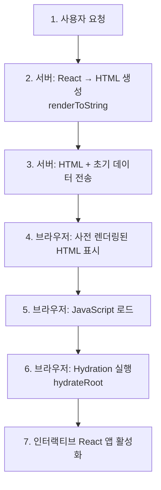

# React 하이브리드 렌더링 프로젝트 구조

## 개요

이 프로젝트는 **React Server-Side Rendering (SSR)** 과 **Client-Side Hydration**을 결합한 하이브리드 렌더링 아키텍처를 구현한 영화 리뷰 애플리케이션입니다.

## 핵심 아키텍처

### 1. 이중 빌드 시스템 (Dual Build System)

프로젝트는 **클라이언트**와 **서버** 두 개의 별도 번들을 생성합니다:

#### 클라이언트 빌드

- **Entry**: `src/client/main.tsx`
- **Output**: `dist/static/bundle.js`
- **목적**: 브라우저에서 실행될 JavaScript 번들 생성
- **역할**: React hydration 및 인터랙션 처리

#### 서버 빌드

- **Entry**: `src/server/main.ts`
- **Output**: `dist/server/server.js`
- **목적**: Node.js 환경에서 실행될 Express 서버 생성
- **역할**: React 컴포넌트를 HTML로 사전 렌더링

### 2. SSR + Hydration 플로우



#### 서버 사이드 렌더링 (SSR)

**파일**: `src/server/routes/index.tsx`

```typescript
// React 컴포넌트를 HTML 문자열로 변환
const renderedApp = renderToString(<App />);

// 초기 데이터를 window 객체에 주입
window.__INITIAL_DATA__ = {
  movies: []
}
```

**장점**:

- 사용자는 JavaScript 실행 전에도 콘텐츠 확인 가능
- 검색 엔진 최적화 (SEO)
- 빠른 First Contentful Paint (FCP)

#### 클라이언트 사이드 Hydration

**파일**: `src/client/main.tsx`

```typescript
// 서버에서 생성된 HTML에 React 이벤트 리스너 연결
hydrateRoot(document.getElementById("root"), <App />);
```

**장점**:

- 서버에서 생성된 DOM 재사용
- 빠른 초기 인터랙티비티
- 완전한 SPA 경험 제공

## 프로젝트 디렉토리 구조

```
react-hybrid/
├── src/
│   ├── client/                  # 클라이언트 사이드 코드
│   │   ├── main.tsx            # 클라이언트 진입점 (hydration)
│   │   ├── App.tsx             # 루트 컴포넌트
│   │   ├── components/         # React 컴포넌트
│   │   │   ├── common/         # 공통 컴포넌트
│   │   │   │   ├── Button.tsx
│   │   │   │   ├── IconButton.tsx
│   │   │   │   ├── Loading.tsx
│   │   │   │   ├── SearchBar.tsx
│   │   │   │   ├── Skeleton.tsx
│   │   │   │   └── Text.tsx
│   │   │   ├── FeaturedMovie.tsx
│   │   │   ├── Footer.tsx
│   │   │   ├── Header.tsx
│   │   │   ├── MovieDetailModal.tsx
│   │   │   ├── MovieDetailModalLoader.tsx
│   │   │   ├── MovieItem.tsx
│   │   │   └── MovieList.tsx
│   │   ├── pages/              # 페이지 컴포넌트
│   │   │   ├── MovieHomePage.tsx
│   │   │   └── MovieDetailPage.tsx
│   │   ├── hooks/              # 커스텀 훅
│   │   │   ├── queries/        # 데이터 페칭 훅
│   │   │   │   ├── useMovieDetail.ts
│   │   │   │   └── usePopularMovies.ts
│   │   │   ├── useMovieDetailModal.tsx
│   │   │   └── useMovieRating.ts
│   │   ├── api/                # API 호출 로직
│   │   │   └── movies.ts
│   │   ├── lib/                # 라이브러리 설정
│   │   │   └── apiClient.ts
│   │   ├── utils/              # 유틸리티 함수
│   │   │   ├── delay.ts
│   │   │   └── storage.ts
│   │   ├── types/              # TypeScript 타입 정의
│   │   │   ├── Movie.types.ts
│   │   │   ├── MovieDetail.types.ts
│   │   │   └── global.d.ts
│   │   └── constants/          # 상수
│   │       └── storage.ts
│   │
│   └── server/                 # 서버 사이드 코드
│       ├── main.ts             # Express 서버 진입점
│       └── routes/             # 라우트 핸들러
│           └── index.tsx       # SSR 로직 (renderToString)
│
├── public/                     # 정적 파일
│   ├── images/                 # 이미지 리소스
│   └── styles/                 # CSS 스타일시트
│
├── dist/                       # 빌드 결과물
│   ├── server/                 # 서버 번들
│   │   └── server.js
│   └── static/                 # 클라이언트 번들
│       ├── bundle.js
│       ├── images/
│       └── styles/
│
├── webpack.client.config.js    # 클라이언트 빌드 설정
├── webpack.server.config.js    # 서버 빌드 설정
├── tsconfig.json              # TypeScript 설정
├── package.json               # 프로젝트 의존성
└── nodemon.json               # 개발 서버 설정
```

## 기술 스택

### 런타임 & 프레임워크

| 기술       | 버전   | 역할            |
| ---------- | ------ | --------------- |
| React      | 19.1.1 | UI 라이브러리   |
| Express    | 5.1.0  | Node.js 웹 서버 |
| TypeScript | 5.9.2  | 타입 안전성     |
| Node.js    | -      | 서버 런타임     |

### 빌드 도구

| 도구         | 역할                              |
| ------------ | --------------------------------- |
| Webpack 5    | 모듈 번들러 (클라이언트 + 서버)   |
| Babel        | JSX/TypeScript 트랜스파일링       |
| ts-loader    | TypeScript 로더                   |
| babel-loader | Babel 로더                        |
| concurrently | 개발 중 클라이언트/서버 동시 빌드 |

### 주요 라이브러리

| 라이브러리  | 용도               |
| ----------- | ------------------ |
| overlay-kit | 모달/오버레이 관리 |
| axios       | HTTP 클라이언트    |
| dotenv      | 환경 변수 관리     |

## 빌드 설정

### 클라이언트 빌드 (webpack.client.config.js)

```javascript
{
  mode: "development",
  entry: "./src/client/main.tsx",
  output: {
    path: "dist/static",
    filename: "bundle.js",
    publicPath: "/static/"
  },
  // Babel 설정: React JSX, TypeScript 지원
  // CSS 로더: style-loader, css-loader
  // 이미지 처리: asset/resource
  // 정적 파일 복사: public/ → dist/static/
}
```

### 서버 빌드 (webpack.server.config.js)

```javascript
{
  mode: "development",
  target: "node",              // Node.js 환경 타겟
  entry: "src/server/main.ts",
  output: {
    path: "dist/server",
    filename: "server.js"
  },
  externals: [nodeExternals()] // node_modules 번들링 제외
}
```

## 개발 워크플로우

### 프로덕션 빌드 & 실행

```bash
# 전체 빌드 (dist/ 초기화 → 클라이언트 빌드 → 서버 빌드)
npm run build

# 빌드 후 서버 실행
npm start
```

### 개발 모드

```bash
# Watch 모드로 3개 프로세스 동시 실행:
# 1) 클라이언트 watch 모드
# 2) 서버 watch 모드
# 3) 서버 실행
npm run dev
```

### 개별 빌드 명령어

```bash
# 클라이언트만 빌드
npm run build:client

# 서버만 빌드
npm run build:server
```

## 하이브리드 렌더링의 장점

### 1. 초기 로딩 속도 개선

- **문제**: 전통적인 SPA는 JavaScript 로드 및 실행 전까지 빈 화면
- **해결**: 서버에서 완성된 HTML 전송 → 빠른 First Contentful Paint (FCP)

### 2. SEO 최적화

- **문제**: 검색 엔진이 JavaScript 실행 없이는 콘텐츠 크롤링 불가
- **해결**: 서버에서 완성된 HTML 제공 → 검색 엔진 최적화

### 3. 부드러운 인터랙티비티

- **문제**: 서버 렌더링만으로는 동적 인터랙션 제한
- **해결**: Hydration 후 완전한 SPA 경험 제공

### 4. 데이터 프리페칭

- **문제**: 클라이언트에서 데이터 페칭 시 추가 로딩 시간 발생
- **해결**: 서버에서 초기 데이터 미리 주입 (`window.__INITIAL_DATA__`)

## 핵심 파일 및 코드

### 1. 서버 사이드 렌더링 (SSR)

**파일**: `src/server/routes/index.tsx`

```typescript
router.get("/", (_: Request, res: Response) => {
  // 1. React 컴포넌트를 HTML 문자열로 변환
  const renderedApp = renderToString(<App />);

  // 2. 초기 데이터를 스크립트로 주입
  const renderedHTMLWithInitialData = template.replace(
    "<!--{INIT_DATA_AREA}-->",
    `<script>
      window.__INITIAL_DATA__ = {
        movies: ${JSON.stringify([])}
      }
    </script>`
  );

  // 3. 렌더링된 앱을 HTML에 삽입
  const renderedHTML = renderedHTMLWithInitialData.replace(
    "<!--{BODY_AREA}-->",
    renderedApp
  );

  // 4. 완성된 HTML 전송
  res.send(renderedHTML);
});
```

### 2. 클라이언트 사이드 Hydration

**파일**: `src/client/main.tsx`

```typescript
import { hydrateRoot } from "react-dom/client";
import App from "./App";

// 1. 서버에서 주입한 초기 데이터 읽기
const initialData = window.__INITIAL_DATA__;

// 2. 서버에서 렌더링된 HTML에 React 연결
hydrateRoot(document.getElementById("root"), <App />);
```

### 3. Express 서버 설정

**파일**: `src/server/main.ts`

```typescript
import express from 'express';
import movieRouter from './routes/index';

const app = express();
const PORT = 3000;

// 정적 파일 제공 (bundle.js, CSS, 이미지 등)
app.use('/static', express.static(path.join(__dirname, '../../dist/static')));

// SSR 라우트
app.use('/', movieRouter);

app.listen(PORT, () => {
  console.log(`Server is running on http://localhost:${PORT}`);
});
```

## 렌더링 흐름 상세

### 1. 사용자 요청 (`GET /`)

```
브라우저 → http://localhost:3000/
```

### 2. 서버 처리

```typescript
// src/server/routes/index.tsx
1. React 컴포넌트를 HTML로 변환
   renderToString(<App />) → "<div>App</div>"

2. HTML 템플릿에 삽입
   - <!--{BODY_AREA}--> → 렌더링된 React HTML
   - <!--{INIT_DATA_AREA}--> → window.__INITIAL_DATA__

3. 완성된 HTML 응답
```

### 3. 브라우저 수신

```html
<!doctype html>
<html>
  <head>
    <link rel="stylesheet" href="/static/styles/index.css" />
  </head>
  <body>
    <!-- 서버에서 렌더링된 HTML (즉시 표시됨) -->
    <div id="root">
      <div>App</div>
    </div>

    <!-- 초기 데이터 -->
    <script>
      window.__INITIAL_DATA__ = { movies: [] };
    </script>

    <!-- 클라이언트 번들 (비동기 로드) -->
    <script src="/static/bundle.js"></script>
  </body>
</html>
```

### 4. Hydration 실행

```typescript
// bundle.js 실행
1. 초기 데이터 읽기: window.__INITIAL_DATA__
2. 기존 HTML에 React 연결: hydrateRoot()
3. 이벤트 리스너 등록
4. 인터랙티브 앱으로 활성화
```

## 성능 최적화 포인트

### 1. Code Splitting (향후 개선 가능)

- 현재: 단일 번들 (`bundle.js`)
- 개선: Route 기반 코드 스플리팅 → 초기 로딩 크기 감소

### 2. CSS 최적화

- 현재: `style-loader` (JavaScript에 CSS 번들링)
- 개선: `MiniCssExtractPlugin` → 별도 CSS 파일 추출

### 3. 이미지 최적화

- 현재: 이미지를 `public/` 폴더에서 복사
- 개선: 이미지 압축 및 최적화 파이프라인

### 4. 캐싱 전략

- 현재: 기본 Express 정적 파일 제공
- 개선: `Cache-Control` 헤더 설정, CDN 활용

## 트러블슈팅

### 1. Hydration Mismatch 오류

**증상**: React가 서버/클라이언트 HTML 불일치 경고

**원인**:

- 서버와 클라이언트에서 다른 데이터 렌더링
- 브라우저 전용 API 사용 (window, document)

**해결**:

- `useEffect`에서 클라이언트 전용 로직 실행
- 서버/클라이언트 동일한 초기 상태 보장

### 2. Module Not Found 오류

**증상**: Webpack 빌드 시 모듈을 찾을 수 없음

**해결**:

```javascript
// webpack.config.js
resolve: {
  extensions: ['.js', '.jsx', '.ts', '.tsx'];
}
```

### 3. CSS가 적용되지 않음

**증상**: 스타일이 렌더링되지 않음

**해결**:

- `public/styles/` → `dist/static/styles/` 복사 확인
- HTML에서 올바른 경로 참조: `/static/styles/index.css`

## 참고 자료

- [React Server Components](https://react.dev/reference/react/use-server)
- [React Hydration](https://react.dev/reference/react-dom/client/hydrateRoot)
- [Webpack Configuration](https://webpack.js.org/configuration/)
- [Express.js Documentation](https://expressjs.com/)

## 다음 단계

1. **라우팅 추가**: React Router를 통한 다중 페이지 지원
2. **데이터 페칭**: 서버에서 실제 API 호출 후 초기 데이터 주입
3. **상태 관리**: Redux, Zustand 등 전역 상태 관리 라이브러리 통합
4. **성능 모니터링**: Lighthouse, Web Vitals 측정 및 최적화
5. **프로덕션 배포**: PM2, Docker 등을 활용한 배포 전략 수립
